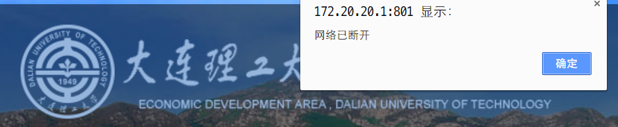
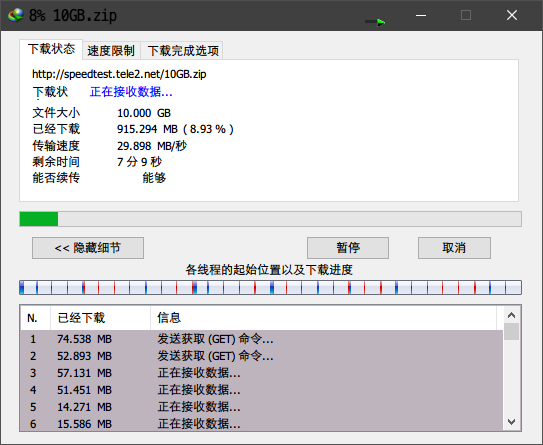
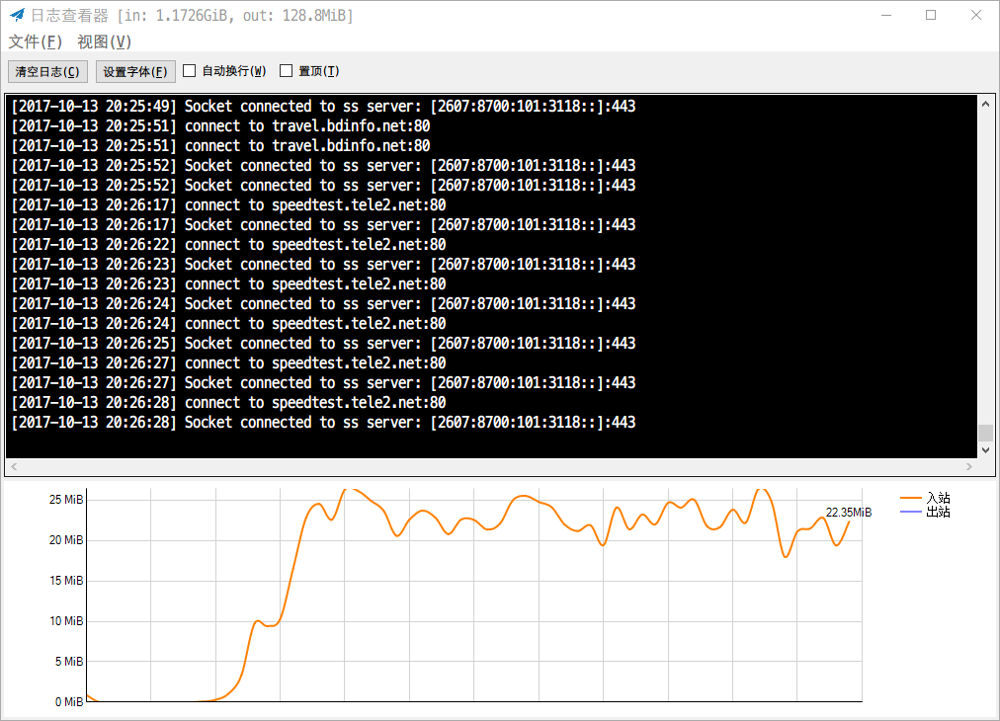
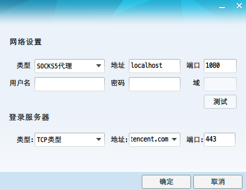
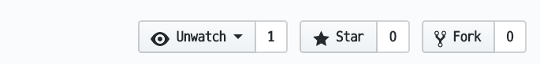
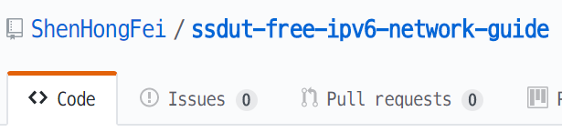

# 大工软院 寝室免费高速IPv6网络 配置指南

A configuration guide for SSDUT(Software School of Dalian University of Technology) students to surf the internet freely in their dormitories.

本文链接： [https://github.com/ShenHongFei/ssdut-free-ipv6-network-guide](https://github.com/ShenHongFei/ssdut-free-ipv6-network-guide)


## 功能

1.  无需登录计费系统，不消耗寝室校园网流量。

    

2.  充分利用高速IPv6网络，下载速度平均 `20 MB/s` ，最高可达 `50MB/s` ，延迟 `170ms` 左右。

    

    

3.  自由浏览国外网站 Google, Youtube。玩外服游戏... (理论上访问国外网站速度会更快）

## 使用说明书

1.  疏通IPv6网络

    1.  在开始菜单中找到 `Windows PowerShell` ，右键以管理员身份运行。
    2.  粘贴运行以下内容。

    ```powershell
    # 配置防火墙（只需运行一次）
        New-NetFirewallRule -DisplayName "Block IPv6 Router Advertisement" -Protocol ICMPv6 -IcmpType 134 -Action Block

    # 配置路由
        New-NetRoute -AddressFamily IPv6 -DestinationPrefix "::/0" -InterfaceAlias 以太网 -NextHop "fe80::2a0:a50f:fc7d:bf00" -RouteMetric 0 -Confirm -ErrorAction Ignore
        New-NetRoute -AddressFamily IPv6 -DestinationPrefix "::/0" -InterfaceAlias 以太网 -NextHop "fe80::2a0:a50f:fc7d:bf01" -RouteMetric 0 -Confirm -ErrorAction Ignore
        Get-NetRoute -AddressFamily IPv6 -InterfaceAlias 以太网 -DestinationPrefix "::/0"
    ```

    3.  测试IPv6网络是否畅通，将校园网注销，在浏览器地址栏中输入 `[2600::]` （包括方括号），应该可以打开网页。至此，**已经可以免流访问所有IPv6网站了**。

    ​

2.  用Shadowsocks作为代理, 通过 `能够访问IPv6网络的服务器` 转发 IPv4流量 

    （服务器我已经搭好，目前开放账号供大家使用，请勿使用BT等P2P手段下载美国有版权的电影，可能会导致服务器被封，可以用百度云离线之后在下载，HTTP不受限制。）

    1.  下载 [https://github.com/ShenHongFei/ssdut-free-ipv6-network-guide/raw/master/shadowsocks.zip](https://github.com/ShenHongFei/ssdut-free-ipv6-network-guide/raw/master/shadowsocks.zip)

    2.  解压，启动 `Shadowsocks.exe` , 在托盘中找到小飞机图标，右键→启动系统代理。

    3.  在托盘中找到小飞机图标，右键→帮助→勾选详细记录日志→显示日志。

    4.  如果 看到日志中有 `Socket connected to ss server: [2607:8700:101:3118::]:666` ，则转发流量成功。

    5.  将软件的本地代理设置为：协议 `Socks5` ，地址 `127.0.0.1` ，端口 `1080` 。

        1.  QQ登录框→右上角小箭头→代理设置

            

        2.  安装浏览器扩展，参考 [http://wxhp.org/shadowsocksr.html](http://wxhp.org/shadowsocksr.html)

    6.  可以愉快地玩耍了。

3.  *进阶设定

    1.  可以使用 `Proxifier` 让不支持Socks5代理的软件也能上网。

## 原理

待更新

请在上方Star



如果Stars多的话会更新。


## 作者

网安1504 沈鸿飞

有问题提交Issue，欢迎改进并pull request。



QQ:350986489

2017/10/14 v1.0